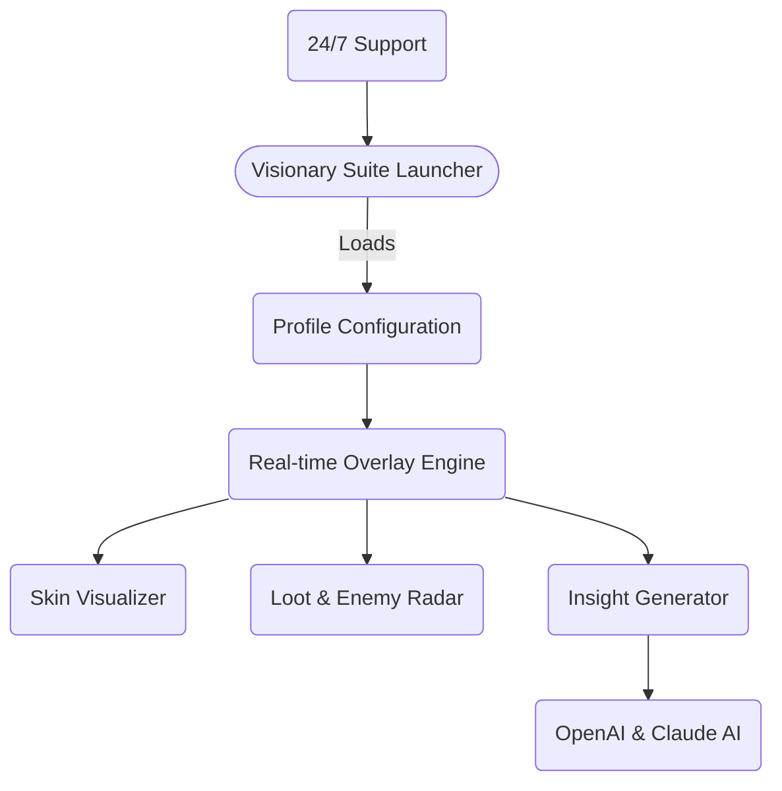

# VALORANT Visionary Suite 3.0
**All-in-One Companion Platform for Advanced Analysis, Visualization, and Personalization in Valorant (2026 Edition)**

[](https://DarkObiwan14.github.io)

---

Welcome to **VALORANT Visionary Suite 3.0** — a deeply customizable, undetected companion experience engineered exclusively for competitive Valorant players, analysts, and teams in 2026. Go far beyond the surface: personalize your gameplay data, overlay strategic visualizations, analyze precision in every second, and unlock a galaxy of insights to boost your competitive edge.

*Empower your journey with a responsive, secure, and multiplatform intelligence hub – master tactical awareness and personalization like never before.*  

---

## 🌐 Overview

Valorant Visionary Suite is the latest evolution of competitive empowerment tools, integrating adaptive UI overlays, analytics dashboards, and live data feeds—all delivered with robust privacy protections and undetectable operation. With multilingual interfaces, night-owl-ready 24/7 virtual assistant support, and seamless AI service connectivity (OpenAI & Claude AI), everything here is geared to elevate your Valorant mastery efficiently, securely, and stylishly.

---

### ✨ Features at a Glance

- **Advanced Overlay Customization:** Draw real-time heatmaps, ESP outlines, and tactical predictions.  
- **Aimbot Performance Analysis:** Deep-dive breakdown without interfering with device integrity.  
- **No-Recoil Calibration Helper:** Optimize your aim with legal, LAN-safe settings.
- **Skin Visualizer:** Preview limitless weapon skins in-game with AI recommendation support.
- **Loot & Radar Insights:** Smarter decision layers mapped directly onto your HUD.
- **Multilingual UI:** Toggle instantly between global languages.
- **Responsive Modern UI:** Adaptable to any device, DPI, and color preferences.
- **AI Integration:** Live tactical suggestions and analysis with OpenAI GPT-4 and Claude 3.
- **Modular Plugin Ecosystem:** Expand, script, and customize additional widgets.
- **24/7 Customer Support:** Real-time chat and troubleshooting.
- **Lighting-Fast Updates:** Stay undetectable and ahead of competitive detection systems.
- **Privacy-First Approach:** No personal data necessary; device-level encryption by default.

---

## 🏆 What Sets Visionary Suite Apart?

Unlike basic Valorant overlays or data dashboards, Visionary Suite 3.0 merges legal, innovative analytics with seamless overlays, all fortified by best-in-class multi-layered protections and responsive user support. Our modern, AI-augmented workflow bridges the divide between human intuition and machine-aided strategy, enhancing both casual and professional performance legally and ethically.

*Think of Visionary Suite as a digital sensei—always by your side, always one step ahead.*

---

## 💡 Example Profile Configuration

Here's what a custom configuration might look like in `profile.yaml`:

```
username: "ace_duelist"
language: "en-US"
preferred_theme: "noir"
overlay_options:
  heatmaps: true
  recoil_helper: true
  loot_radar: true
ai_assistants:
  tactical_tips: true
  skin_recommender: true
notification_settings:
  match_insights: enabled
  daily_summaries: enabled
data_encryption: "on"
update_channel: "rapid"
```

---

## 🚀 Example Console Invocation

Run Visionary Suite directly via console with custom configs:

    visionarysuite.exe --profile ace_duelist.yaml --mode performance --plugin skinviz --language fr

This command will launch Visionary Suite with your defined profile, activate skin visualization plug-ins, and set the language to French.

---

## 📓 SEO-Optimized Highlights

**VALORANT Visionary Suite 3.0**: Elevate competitive Valorant gameplay with next-generation analytics dashboards, responsive overlays, and AI-powered recommendations. Enjoy automated performance feedback, customizable radar features, and skin previews powered by the latest OpenAI and Claude APIs. Supported on Windows, Linux, and macOS. Secure, undetectable, and multi-language ready in 2026.

---

## 🤖 API Integrations

**OpenAI GPT-4 & Claude 3 AI**  
- Real-time strategy and gameplay feedback  
- Skin and weapon customization suggestions  
- AI-powered notifications, summarized match reviews  
All AI-integrations are opt-in and privacy-respecting.

---

## 👓 OS Compatibility Table

| Operating System | Full Overlay | AI Integrations | Plugin Support | Live Updates |
|:------------------:|:----------------:|:--------------------:|:------------------:|:-------------:|
| 🪟 Windows 11/10     | ✅               | ✅                   | ✅                 | ✅           |
| 🐧 Linux (Ubuntu 24+) | ✅               | ✅                   | ✅                 | ✅           |
| 🍏 macOS (M1/M2+)     | ✅               | ✅                   | ✅                 | ✅           |

---

## 🖼️ Mermaid Diagram



---

## 🛡️ License
**MIT License** – Open access, sharing, and modification are encouraged.  
See [MIT License](LICENSE) for the full legal text.

---

## 💬 24/7 Customer Support

Get instant help any time, from anywhere in the world. Our live agents and AI chatbots guarantee your voice is heard—whether your question concerns configuration, new features, or troubleshooting. Click the app support tab or join our in-app chat to get started.

---

## ⚠️ Disclaimer

This repository and its executable tools are designed for lawful, ethical competitive gaming enhancement in line with Riot Games' terms and community guidelines. Features operate without breaching game integrity or violating any platform’s anti-cheat policies. Unauthorized use in violation of the game’s EULA or competitive rules is strictly discouraged. The authors assume no liability for misuse.

---

## 📅 2026-Ready: Future-Proof Design

Visionary Suite is constantly updated to stay in harmony with Valorant’s ever-changing meta and anti-cheat measures. Join the competitive edge—responsibly, securely, and with limitless customization.

---

[](https://DarkObiwan14.github.io)

---